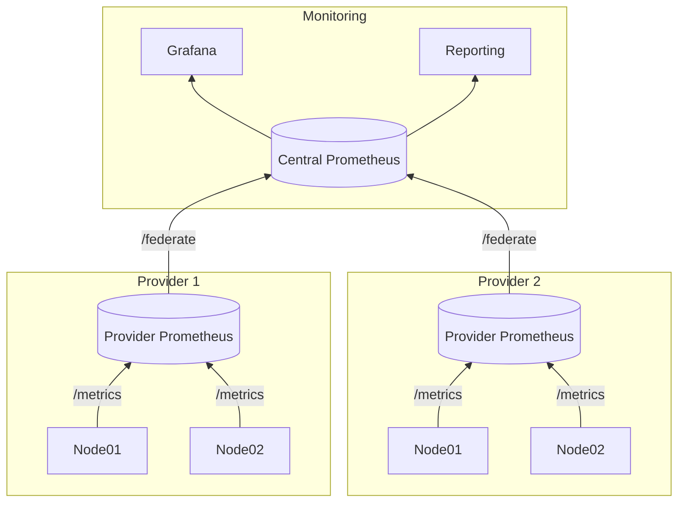

# Monitoring setup with federated prometheus

## Federated prometheus
To be able to show and measure individual provider data we need to be able to access the prometheus statistics of that provider. This could be done by adding all worker nodes of a provider to a central prometheus but this would be cumbersome since nodes can change for maintenance, replacement or other reasons. 

More logical is to use a federated prometheus setup, were the individual providers maintain their own prometheus instance which then federates its data to a central monitoring instance:



## Central Prometheus

The central prometheus would have a job per provider to ingest the federate information from the provider's prometheus:
 
```
  - job_name: "stakeworld"
    scrape_interval: 15s
    honor_labels: true
    metrics_path: "/federate"
    params:
      "match[]":
        - '{job="stakeworld"}'
    static_configs:
      - targets:
        - monitor.stakeworld.io:9091
  - job_name: "provider2"
    scrape_interval: 15s
    honor_labels: true
    metrics_path: "/federate"
    params:
      "match[]":
        - '{job="provider2"}'
    static_configs:
      - targets:
        - mon.provider2.io:9090
  - job_name: "provider3"
    scrape_interval: 15s
    (...)
```

## Provider prometheus

The provider's prometheus would scrape it's own rpc node's and enable access to this information to the central prometheus. 

This would preferably be a seperate prometheus instance which only knows the relevant endpoints (for example a seperate VPS instance with only that function) or can be an extra job on the existing prometheus of a provider. This can have some downsides: 1. technically also other info could be exposed to the monitoring instance and 2. you have to be carefull with your own panels so that you don't measure data twice since the are ingested twice (you would have to split them for example with a {job=....} identifier).

A typical job would be: 

```
scrape_configs:
  - job_name: "stakeworld"
    scrape_interval: 5s
    static_configs:
      - targets: ['node01:9615']
      - targets: ['node02:9615']
```

## Access 

Access should be granted to the central monitor to access the provider prometheus, this can be done by opening a port via the firewall, for example:

``` 
ufw allow from 18.156.32.189 to any port 9090
```

If there is a wish in the future this could also be done through a vpn connection, so the connection would be encoded.
